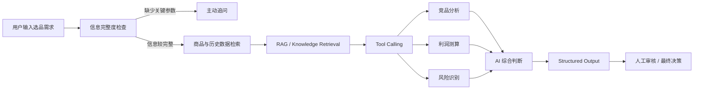

# Ozon Enterprise Product Selection Agent
## Ozon 企业级 AI 选品 Agent

Enterprise-oriented AI product-selection Agent prototype for cross-border e-commerce scenarios.

基于真实跨境电商选品场景设计的 AI Agent 产品原型，目标是降低商品数据收集、竞品分析、利润测算与历史经验复用过程中的人工成本，并提升 AI 辅助决策的稳定性与可验证性。

> **项目说明：** 当前仓库中的演示与评估数据均为 synthetic / mock data，仅用于项目展示、功能验证与 Evaluation，不代表真实 Ozon 市场数据。

---

## Recruiter Quick View｜招聘方快速了解

| 项目 | 内容 |
| --- | --- |
| 业务问题 | 商品信息分散、竞品分析依赖人工、利润判断标准不统一、历史经验难沉淀 |
| 核心用户 | 跨境电商运营人员 / 选品人员 |
| 产品目标 | 将商品检索、竞品分析、利润测算、风险识别与历史经验检索整合到 AI 辅助决策流程 |
| 产品思路 | 确定性任务 Workflow 化，需要动态判断的环节 Agent 化，并保留人工审核与最终决策 |
| AI 设计 | RAG、Tool Calling、Structured Output、Agent Workflow；Memory 能力仍在持续规划与迭代 |
| Evaluation | Task Success Rate、Tool Calling Accuracy、Answer/Data Accuracy、Latency、Cost 等 |
| 当前阶段 | 核心架构和部分功能已实现，Agent 稳定性、信息完整度检查与自动化 Evaluation 持续迭代中 |

### My Role｜我的角色

独立完成业务问题梳理、核心用户与场景分析、产品流程及 Agent Workflow 设计，并持续推进后端接口、确定性业务工具、Evaluation 与项目文档实现。

项目目前仍处于持续迭代阶段，README 中会明确区分 **已完成、迭代中与后续规划**，不将规划能力描述为已实现能力。

---

## Why this project exists｜为什么做这个项目

The project targets common product-selection problems in cross-border e-commerce: fragmented product information, manual profit judgment, inconsistent competitor-comparison standards, compliance risk, and difficulty auditing AI-assisted decisions.

这个项目来源于我在跨境电商运营实践中观察到的实际问题：

- 商品信息需要在平台、插件和表格之间反复收集、整理
- 竞品分析和利润判断大量依赖人工
- 不同运营人员的判断标准难以统一
- 历史选品经验难以系统沉淀和复用
- AI 最终输出“看起来合理”，并不代表业务任务真的完成正确

因此，我尝试先把选品任务拆解成结构化业务流程，再在真正需要动态判断的环节引入 Agent。

---

## Product Workflow｜产品流程

> 以下为目标产品流程。部分能力已经实现，部分仍处于开发或评估阶段。



---

## Demo / Product Preview｜产品展示

> 以下截图使用 synthetic / mock data，仅用于展示产品原型和功能验证，不代表真实 Ozon 市场数据。

### 1. Agent / 产品主界面


展示重点：

- 用户如何提出任务
- Agent 如何接收业务需求
- 产品界面和主要交互入口

### 2. 商品分析 / 任务执行结果

<!--


-->

展示重点：

- 商品数据或业务数据输入
- 分析结果
- 利润 / 竞品 / 风险等结构化输出
- Agent 是否真正产生业务交付物

### 3. Evaluation / 后台验证

<!--


-->

展示重点：

- Evaluation 测试
- Tool Calling / Task Success 等结果
- 后端接口或测试结果
- 结果正确性验证

---

## Why Agent + Workflow｜为什么采用 Agent + Workflow

本项目不追求将所有业务步骤全部 Agent 化。

对于规则明确、确定性较高的任务，例如：

- 利润计算
- 字段校验
- 数据清洗
- 固定业务规则判断
- 标准化数据查询

优先采用固定 Workflow 或确定性 Tool。

原因是这类任务更需要：

- 稳定性
- 数据准确性
- 可解释性
- 可测试性
- 成本可控性

而对于开放式任务，例如：

- 当前还缺少哪些关键业务信息？
- 应该优先查询哪些数据？
- 需要调用哪些工具？
- 是否需要继续分析？
- 是否需要向用户主动追问？

则更适合由 Agent 根据任务目标和上下文动态判断。

> **设计原则：确定性任务 Workflow 化，真正需要动态决策的部分 Agent 化。**

---

## Agent Evaluation｜Agent 评估

我认为：

> **Task delivery ≠ Task correctness**
>
> 有交付物，不代表业务任务真正完成正确。

例如，一个 Agent 即使成功生成 Excel、分析结果或推荐结论，也仍然可能存在：

- 字段映射错误
- 工具调用错误
- 参数错误
- 数据计算错误
- 缺少关键输入却直接得出结论
- 没有数据或证据支撑的业务判断

因此，本项目不会只判断最终答案是否“看起来合理”，而是从多个维度评估 Agent。

| 指标 | 关注问题 |
| --- | --- |
| Task Success Rate | 用户要求的完整任务是否真正完成 |
| Tool Calling Accuracy | 是否调用正确工具，参数是否准确 |
| Answer / Data Accuracy | 数据、计算结果与字段映射是否正确 |
| Clarification Quality | 关键信息不足时是否能够识别并主动追问 |
| Unsupported Claim Rate | 是否出现缺乏数据或证据支持的结论 |
| Latency | 完成一次任务需要多长时间 |
| Cost | LLM / Tool 调用成本是否合理 |

当前 Evaluation 仍处于持续设计与迭代阶段。

代码库中已包含部分：

- evaluation service
- tests
- manual Golden Case baseline
- Stability Sprint specification

相关文档：

- `docs/evaluation/BASELINE_MANUAL_EVAL_v1.md`
- `docs/evaluation/STABILITY_SPRINT_v1.md`

---

## Development Status｜当前开发状态

### ✅ 已完成 / 代码库中可查看

- FastAPI API 层
- Agent intent / planning 基础
- Controlled Tool Registry
- 商品、利润、竞争度等确定性业务逻辑
- 企业商品数据模型
- Alembic 数据库迁移
- 知识库相关接口与服务
- Evaluation service 与基础测试
- 面向人工审核的决策输出
- Chrome Extension 数据提取 / 测试基础

### 🚧 迭代中

当前 Stability Sprint 重点处理：

- Intent Routing / Fast Path
- Agent State leakage / 状态稳定性
- Entity Resolution
- Single Source of Truth for Agent results
- Tool Policy / Tool Budget
- Recommendation Gate
- Data Sufficiency / Provenance
- Fallback / Idempotency
- 信息完整度检查
- 主动澄清策略

### 🧭 后续规划

- 更完整的 Long-term Memory
- 更系统的自动化 Evaluation
- 更多业务 Golden Cases
- 更稳定的 Agent 多步骤执行
- 更完善的产品交互与主动澄清机制
- 企业权限与审计能力
- 日志、Trace 与监控
- 生产级安全与可观测性能力

---

## Tech Stack｜技术栈

### AI Application

`LLM` · `Agent Workflow` · `RAG` · `Tool Calling` · `Structured Output` · `Evaluation`

### Backend

`Python` · `FastAPI` · `SQLAlchemy` · `Alembic` · `REST API`

### Data / Engineering

`MySQL` · `API Integration` · `Deterministic Business Logic` · `Testing`

### Extension

`Chrome Extension` · `JavaScript` · `HTML`

---

## Current Repository Structure｜代码结构

### `backend/`

FastAPI backend、确定性业务工具、Agent orchestration、Evaluation endpoints、数据库模型 / migration 与 tests。

### `extension/`

Chrome Extension，用于 Ozon 页面数据提取以及竞品数据自动填充相关实验。

### `demo-data/`

明确标记为 synthetic / mock 的演示数据，用于 portfolio 和测试。

### `docs/evaluation/`

Manual Golden Case baseline、Stability Sprint specification 与 Evaluation 相关文档。

### `docs/security/`

GitHub 上传、安全策略与仓库发布相关说明。

### `screenshots/`

产品界面、任务执行、分析结果与 Evaluation 展示截图。

---

## Local Setup｜本地运行

```bash
cd backend

python -m venv .venv

# Windows
.venv\Scripts\activate

# macOS / Linux
source .venv/bin/activate

pip install -r requirements.txt

cp .env.example .env

python -m uvicorn app.main:app --host 127.0.0.1 --port 8000 --reload
```

将自己的 API Credentials 仅写入本地 `.env`。

**Never commit `.env`.**

---

## Data and Security｜数据与安全

公开 GitHub 仓库不会上传：

- 真实 `.env` 与 API Key
- 密码及账户凭证
- 企业真实业务敏感数据
- SQLite 数据库及数据库备份
- Python 虚拟环境
- pytest / cache 文件
- runtime knowledge uploads
- 本地运行日志

发布前请参考：

`GITHUB_UPLOAD_MANIFEST.md`

---

## Limitations｜当前局限

This repository is still under active development.

目前项目仍处于持续开发和评估阶段，因此以下能力不应描述为已经完整实现：

- Chat History 的完整产品化能力
- Long-term Memory 的完整闭环
- Production SSO
- Production secrets management
- Real external market connectors
- Production-grade observability
- 完整企业权限体系
- 大规模真实用户验证

Long-term Memory should not be claimed as complete unless it is later implemented and regression-tested.

项目当前定位是：

> **基于真实业务问题设计、能够验证核心 AI 产品思路的 Agent 产品原型与工程实践，而不是已经完成商业化部署的生产级系统。**

---

## Project Focus｜项目关注点

这个项目希望验证的不只是：

> **“大模型能不能生成一个答案？”**

而是进一步关注：

> **“AI Agent 是否能够在真实业务约束下，以可控、可验证、可解释的方式正确完成任务？”**

这也是后续项目持续迭代的核心方向。
